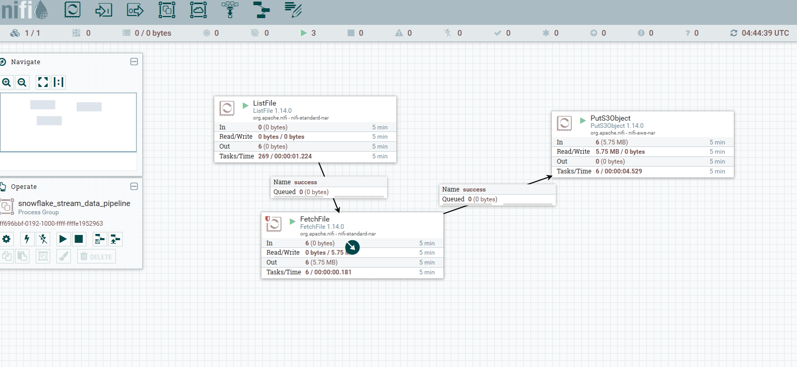

# CustomerTrack: Real-time SCD Pipeline

## Overview
CustomerTrack is a sophisticated real-time data pipeline that demonstrates enterprise-grade data engineering capabilities through the implementation of both SCD (Slowly Changing Dimension) Type 1 and Type 2 methodologies. The pipeline showcases the ability to handle streaming data while maintaining historical records and current state data efficiently.


## Technical Highlights
- Real-time data streaming pipeline
- Containerized data generation service
- Cloud-based infrastructure (AWS)
- Automated data ingestion and processing
- Implementation of both SCD1 and SCD2 patterns
- Efficient data versioning and historical tracking

## Architecture Components

### Data Generation Layer
- Custom Python script using Faker library
- Docker containerization
- Volume mounting for data sharing
- Configurable data generation intervals

### Data Ingestion Layer
- Apache NiFi for data flow management
- Apache ZooKeeper for distributed coordination
- AWS EC2 for hosting services
- S3 bucket for data lake storage



### Data Processing Layer
- Snowflake for data warehousing
- Snowpipe for automated data loading
- Stream-based change data capture
- Scheduled data processing tasks

Snowpipe Creation:
```SQL
create or replace pipe customer_s3_pipe
auto_ingest = true
as
copy into customer_raw
from @SCD_PROJECT.SCD2.customer_ext_stage;
```

Snow Stream creation:
```SQL
create or replace stream customer_table_changes on table customer;
```

## Pipeline Workflow

1. **Data Generation**
   ```python
   # Simulated real-time data generation
   # Reference: app.py

   if __name__ == "__main__":
    file_counter = 0
    try:
        while True:
            current_time = update_time_stamp()
            file_counter += 1

            print(f"Generating fake data, Batch #: {file_counter} at {current_time}.")

            create_csv_file(current_time)

            time.sleep(150)

    except KeyboardInterrupt:
        print("Generation stopped manually.")

    finally:
        print(f"{file_counter} batches generated, final file time: {current_time}.")

   ```

2. **Data Ingestion**
   - NiFi monitors mounted volume real time
   - Files are processed and moved to S3
   - Snowpipe automatically loads data to staging

3. **Data Processing**
   - Scheduled procedure runs every minute
   - Updates SCD1 main table
   - Captures changes via Snowflake streams
   - Maintains historical records in SCD2 table

## Technical Design Decisions

### SCD1 and SCD2 Implementation
The project implements a dual-table strategy:
- **SCD1 Main Table**: 
  - Maintains current, accurate data
  - Optimizes query performance
  - Eliminates redundancy
  
- **SCD2 History Table**:
  - Tracks historical changes
  - Maintains data lineage
  - Enables point-in-time analysis

### Performance Optimization
- Separation of current and historical data reduces compute time
- Efficient merge operations for real-time updates
- Stream-based change capture minimizes processing overhead

### Scalability Considerations
- Containerized architecture enables easy scaling
- Cloud-based infrastructure allows for flexible resource allocation
- Parallel processing capability through Snowflake

## Real-World Applications

This pipeline architecture demonstrates enterprise-ready capabilities for:
- Customer data management systems
- Financial transaction tracking
- Product inventory management
- User profile management
- Compliance and audit systems

The separation of SCD1 and SCD2 tables reflects real-world requirements where:
- Business teams need quick access to current data
- Audit teams require historical tracking
- Analytics teams need point-in-time analysis capabilities

## Code Structure

### Docker Configuration
```yaml
# Reference: docker-compose.yml
# Container setup for NiFi and ZooKeeper
```

### Data Processing Logic
```sql
-- Reference: procedure_and_task.sql
-- Automated data processing procedure (snippet of logic)
create or replace procedure pdr_pipeline_scd2_customer()
returns string
language sql
as
$$
BEGIN
    -- Update main table from staging table (coming from S3 via SnowPipe)
    merge into customer c 
    using customer_raw cr
       on  c.customer_id = cr.customer_id
    when matched and (c.first_name  <> cr.first_name  or
                     c.last_name   <> cr.last_name   or
                     c.email       <> cr.email       or
                     c.street      <> cr.street      or
                     c.city        <> cr.city        or
                     c.state       <> cr.state       or
                     c.country     <> cr.country)
    then update
    set c.customer_id = cr.customer_id
            ,c.first_name  = cr.first_name 
            ,c.last_name   = cr.last_name  
            ,c.email       = cr.email      
            ,c.street      = cr.street     
            ,c.city        = cr.city       
            ,c.state       = cr.state      
            ,c.country     = cr.country  
            ,update_timestamp = current_timestamp()
    when not matched then insert
        (c.customer_id,c.first_name,c.last_name,c.email,c.street,c.city,c.state,c.country)
    values 
        (cr.customer_id,cr.first_name,cr.last_name,cr.email,cr.street,cr.city,cr.state,cr.country);
    
        
    -- Truncate staging table
    truncate table customer_raw;
    
    
    -- Update SCD2 History Table
    merge into customer_history ch
    using v_customer_changing_data ccd
    ...
    ... -- Please refer to the SQL file for full query.
    
```

### Data Versioning
```sql
--  Reference: scd2.sql
--  Historical data tracking implementation
--  View creation sample
-- --------------------------------------------
-- View to format and capture changes from Stream that is present on customer (final table) to use to update the customer_history table (SCD2 table)
create or replace view v_customer_changing_data as (
--INSERT/FALSE - NEW ROW
with insert_row as (
select 
    CUSTOMER_ID, 
    FIRST_NAME, 
    LAST_NAME,
    EMAIL, 
    STREET, 
    CITY,
    STATE,
    COUNTRY,
    UPDATE_TIMESTAMP,
    'I' as DML_TYPE
FROM scd_project.scd2.customer_table_changes
WHERE METADATA$ACTION = 'INSERT'
AND METADATA$ISUPDATE = 'FALSE'
),
-- The entry that will be marked current in the SCD2 table.
update_row_insert as(
select 
    CUSTOMER_ID, 
    FIRST_NAME, 
    LAST_NAME,
    EMAIL, 
    STREET, 
    CITY,
    STATE,
    COUNTRY,
    UPDATE_TIMESTAMP,
    'U' as DML_TYPE
FROM scd_project.scd2.customer_table_changes
WHERE METADATA$ACTION = 'INSERT'
AND METADATA$ISUPDATE = 'TRUE'
),
-- The entry that will be marked not-current in the SCD2 table.
update_row_delete as (
----------- Please refer to SQL file for full query.
```

## Technical Capabilities Demonstrated

1. **Data Engineering**
   - Stream processing
   - Data pipeline architecture
   - ETL/ELT implementation

2. **Cloud & Infrastructure**
   - Docker containerization
   - AWS service integration
   - Distributed systems management

3. **Data Modeling**
   - Dimensional modeling
   - SCD pattern implementation
   - Change data capture

4. **Automation**
   - Scheduled procedures
   - Automated data loading
   - Continuous data processing

## Project Significance

This project showcases the ability to:
- Design and implement enterprise-grade data pipelines
- Handle real-time streaming data effectively
- Apply industry-standard data modeling patterns
- Build scalable, maintainable data solutions
- Balance performance and historical tracking requirements
---
